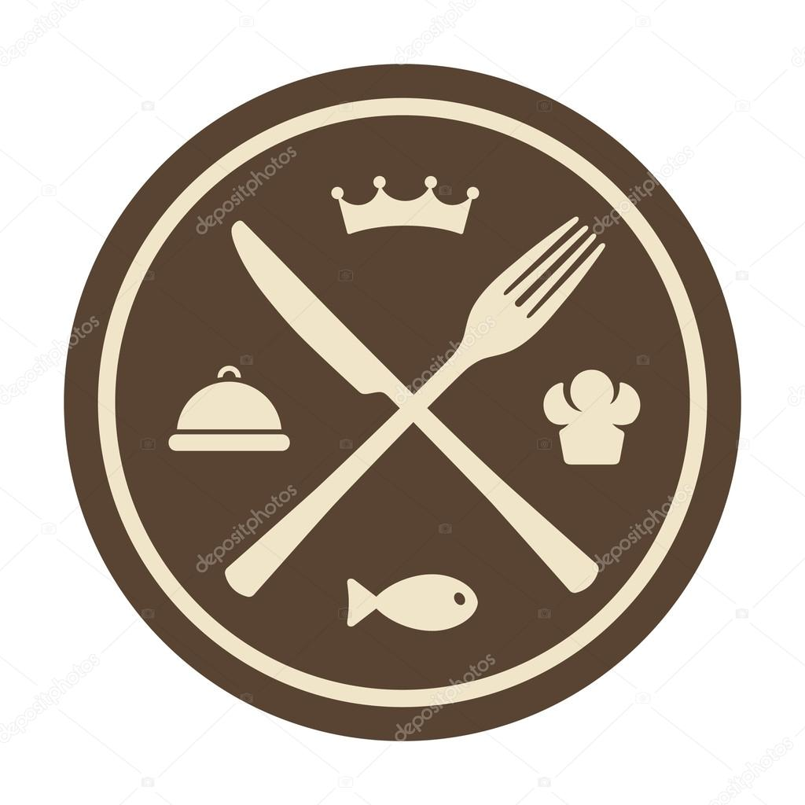

<html>

# Projeto Restaurante

- Projeto apresenta, cardápio de um restaurante de pratos clássicos.

- O cardápio apresenta, pratos de entradas, massas, carnes, bebidas, saladas, sobremesas.

- Coloquei botoes na aplicação com as categorias dos pratos, assim facilitando a navegação do usuário.

- Quando o botão é selecionado, um background é ativado no fundo, para o usuário saber em que categoria está.

- Também coloquei um campo de entrada, para o usuário poder escrever o tipo de prato que deseja.

- Neste campo de entrada, não á, necessidade do usuário aperta o enter, pois, conforme for digitando as letras, ele renderizará os pratos referentes.

- Também desenvolvi o projeto, para funcionar em todos os tipos de telas atuais.

# Ferramentas Utilizadas

- React

- Styled-components

- Métodos nativos no JavaScript

- Para acessar o site, é só clicar no GIF abaixo.

    

    
    
    

</html>
